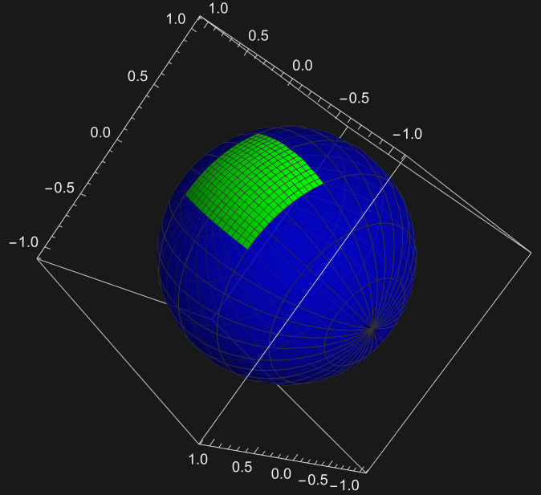
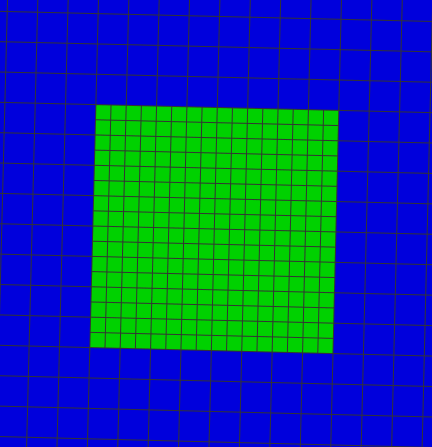
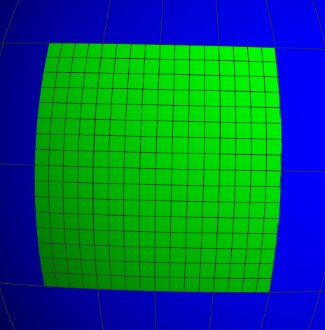
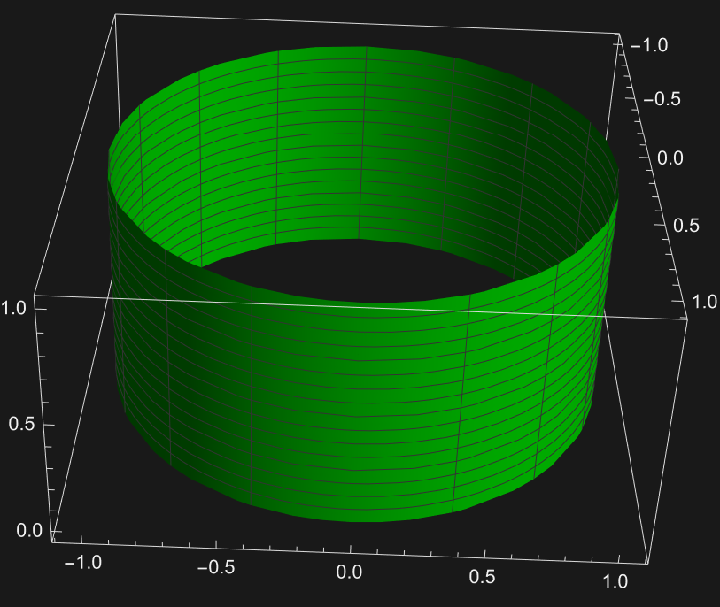
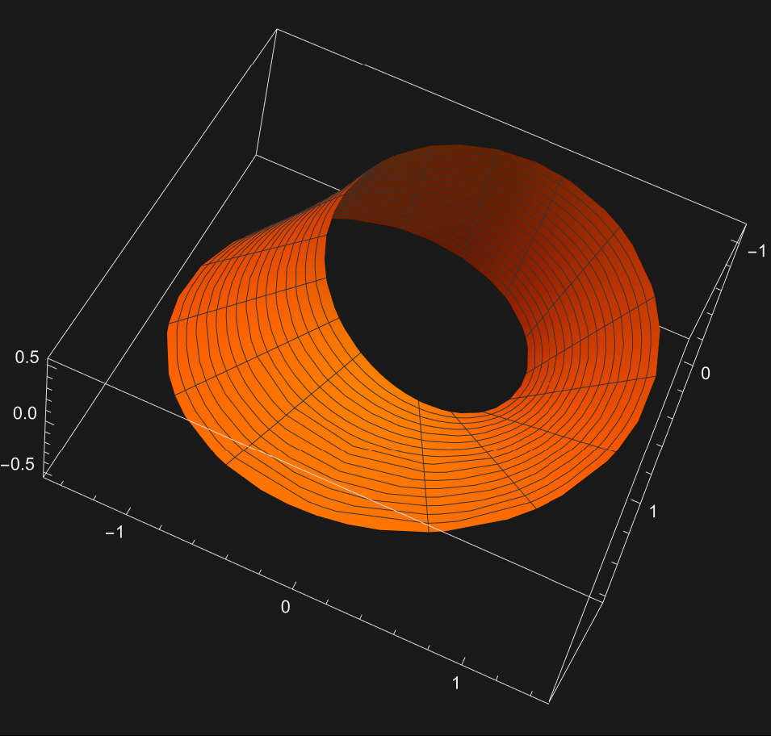
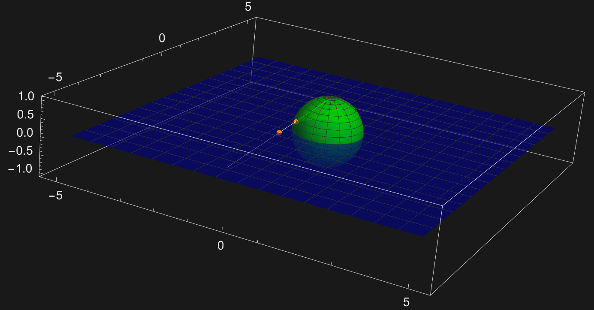
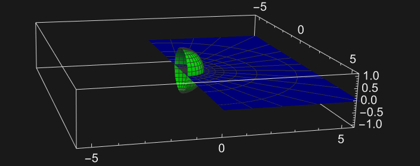

# A Conceptual Idea of Manifolds
At the most basic level, Manifolds are objects that locally behave "normally". For example, the surface of the Earth can be thought of as locally flat, but globally spherical. The easiest way to picture this might be using maps. A map of a city might have fairly accurate scale and angles of buildings and streets, but in a map of a larger area, such as a continent, areas or angles are going to be distorted. 

A model planet
 

Two different distorted maps of the continent

A real-life example of this is Greenland in the standard maps of the Earth, which is distorted so that it looks massive compared to the areas closer to the equator. A manifold can be thought of as a collection of maps that covers every point on Earth with a map that locally doesn't distort it. This is a way of representing the earth as a "normal" flat surface while locally maintaining its original properties. 

# Surfaces

Manifolds can also exist in higher dimensions, and in that case, the maps would be one dimension less than the space that they're mapping. 2D maps are known as surfaces, and the surface of almost any 3D shape in our world can be represented as a manifold. In order for a shape to have a manifold, it can't extend infinitely in any direction and it must have two different sides. A 3D shape that can't be separated into two sides is known as nonorientable, and some examples are the mobius strip and Klein bottle. Shapes that can be separated into two sides are known as orientable, and most shapes fall into this category.

An example of an orientable surface

An example of a nonorientable surface

# Definitions

## Charts

If we have a collection of maps of a surface, a chart is a subset of those maps with a function that links them to another subset of maps. This function has to be a bijection, otherwise some points might go to two places on another map, which doesn't make sense. The idea of a chart allows us to take a collection of maps and start linking them together to form the actual surface that we want to represent.

## Diffeomorphisms

Basically, two collections of maps are diffeomorphic if there exists an infinitely differentiable invertible function that maps one to the other. This allows us to organize different types of sets of maps into categories. The inverse function theorem says that the function between the collections of maps just needs to be invertible and have an invertible Jacobian matrix, giving another way to determine whether a function is a diffeomorphism. 

## Atlases

We say that two charts are compatible if both of the functions for the charts link the parts of the maps that the charts share together "nicely" and the function that goes from one output subset to another is a diffeomorphism. This allows us to combine different charts together.

An atlas is a collection of charts that cover every point on the surface and where any two charts in the collection are compatible. Notice that this collection of charts can be uncountably large as long as they are all compatible. This finally allows us to define a whole surface in terms of maps.

An example of an atlas for a sphere is the charts of the stereographic projection of the sphere from the north or south pole. A stereographic projection of a sphere is created by defining a plane that goes through the center of the sphere and drawing lines through one of the poles. The points where these lines intersect the plane and where they intersect the sphere are linked together, creating a map of the whole sphere except for the pole we drew the lines through. These maps extend infinitely in all directions, and they cover the whole sphere because the point that each map misses on the pole is covered by the other map. These maps are also compatible.

A stereographic projection, hightlighting two points that are getting mapped together

## Manifolds
A manifold is a surface that is covered by an atlas with a list of charts. It is also important that in a chart of a manifold, no two points get mapped to the same place, because that would mess with the idea of distance. 

One example of this is Google Earth, which uses a bunch of maps to give a very accurate model of the earth. In that case, distances and angles of the sphere are more or less preserved, but this isn't always the case. 

A map of the US in Google Earth

For example, the stereographic projection of a sphere from one of its poles to a plane almost creates a manifold, but is missing the point at the pole. If the stereographic projections from both poles are combined, however, then these cover the entire surface, and since these projections never map two points to the same place, they form a manifold.

While we have mainly been dealing with surfaces, there also exist manifolds in other dimensions as well as in much more abstract spaces. For example, we call the set of all lines in a plane that go through the origin the real projective plane ($\mathbb{R}P^2$). In this plane, any nonzero vectors pointing in the same direction are considered the same, and since the "map" we are making of this space is a line, a line in this plane needs to get mapped to a single point on the line. One way to do this is by making a "map" of the slopes of the lines (the $m$ in $y=mx$). Since each line has a unique slope and every slope makes a line, this works as a map, but it misses the line $x=0$. In order to fix this, we can take another map of the inverse slopes (the $\frac1m$ in $x=\frac{y}{m}$). This map misses the line $y=0$, but together these two maps form a manifold.

## Submanifolds
A part of a manifold can also be cut off to create a new manifold. For example, if you cut a sphere in half, then it can still be represented by the stereographic projections of the half-sphere on a half-plane.

Stereographic Projection of a half-sphere
